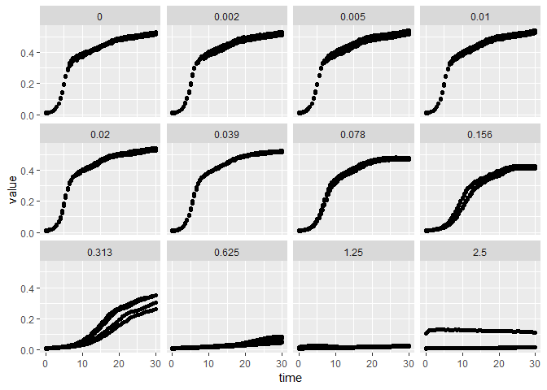

**Before we start**
-------------------

------------------------------------------------------------------------

> ### Learning Objectives
>
> -   Use R to practice loading, manipulating, and visualizing growth
>     rate data.
> -   Implement growth rate models in R.
> -   Examine more complex growth data to challenge model assumptions.

To follow along without lots of copying and pasting, you can download [a
script with nothing but the R code
here](../scripts/E-01-growth-rates.R).

------------------------------------------------------------------------

Loading some growth rate data
-----------------------------

In this exploration we'll load some real experimental growth rate data
into R. If you haven't already, the readings [introducing
R](../readings/R-01-intro-to-r), [starting with
data](../readings/R-02-starting-with-data), and [using
ggplot2](../readings/R-04-visualization-ggplot2) provide some background
to the coding we'll use here.

In some cases we might start with data stored locally on our computer,
or online via a link. But here we'll take advantage of a data set that
is built into an R package called **`growthrates`**. Unless you've been
doing some growth rate modeling on your own, you probably don't have
this package installed yet. In RStudio, install it with the
`install.packages()` function, calling
`install.packages("growthrates")`. Now let's load it into our R session
with library().

``` {.r}
## only uncomment the next line if you need to install growthrates
#install.packages("growthrates")

## loading the package
library(growthrates)
```

    ## Loading required package: lattice

    ## Loading required package: deSolve

> ### Advanced note -- checking for installed packages
>
> If you were writing a script that needed a user to load a certain
> package, it is better to check if they've installed it, then load or
> install+load as necessary. Here's an example piece of code that does
> it. Don't stress if this feels too advanced.
>
> ``` {.r}
> if(!require(growthrates)) install.packages("growthrates",repos = "http://cran.us.r-project.org")
> ```

Getting to know the new package and data
----------------------------------------

Okay, so we've loaded the package. Let's used `?` to look at the help
file.

``` {.r}
?growthrates
```

From the help file, you can see that this package has several functions
to fit models to experimental growth rate data. From the examples at the
bottom it looks like they've included some data sets. They work with the
data `bactgrowth` in this example. If you want to know what data are
included in a package, the `data()` function can help you.

``` {.r}
data(package = "growthrates")
```

So we can see that there are two datasets: *bactgrowth* and
*antibiotic*. It turns out that *bactgrowth* is an extremely messy
dataset that the package authors included to show how their
model-fitting works on tricky data. *antibiotic* is a bit easier to
interpret. Let's use the ? function to see what these data are.

``` {.r}
?antibiotic
```

We can see that these data are growth rates for the bacterium
[Pseudomonas putida](https://en.wikipedia.org/wiki/Pseudomonas_putida),
grown at different concentrations of the antibiotic tetracycline. This
is an interesting bacterium; it may prove useful for clearing polluted
soils of some byproducts of petroleum refining. Even though we've loaded
the package **`growthrates`**, we still need to load the data. Here the
`data()` function comes into play again.

``` {.r}
data(antibiotic)
```

> ### Advanced note -- the diverse outputs of a single function
>
> You may be surprised that the data() function could yield a list of
> data, or load a particular data set, depending on the arguments you
> enter. Many functions in R can take a range of arguments, and the
> output many depend on what arguments you chose to specify. The help
> function `?` (here you'd use `?data`) is useful for exploring
> everything that a function can do.

Let's get back to the data. After running `data(antibiotic)` you can see
in the upper right of RStudio that we have a new object in our globl
environment. Now we must figure out how it is organized. There are
several functions that summarize a data set for easy reading. One
particularly useful one is `str()`.

``` {.r}
str(antibiotic)
```

    ## 'data.frame':    2928 obs. of  5 variables:
    ##  $ time    : num  0 0.5 1 1.5 2 2.5 3 3.5 4 4.5 ...
    ##  $ variable: Factor w/ 48 levels "R_R3_0","R_R3_0.002",..: 1 1 1 1 1 1 1 1 1 1 ...
    ##  $ value   : num  0.00881 0.00981 0.01281 0.01781 0.02281 ...
    ##  $ conc    : num  0 0 0 0 0 0 0 0 0 0 ...
    ##  $ repl    : Factor w/ 4 levels "R3","R4","R5",..: 1 1 1 1 1 1 1 1 1 1 ...

What is this summary telling us? A lot! We see that there are 2928
observations (rows) in our data, and each observation has 5 variables
(columns). `time` and `value` are our key variables here. `time` tells
us the time in hours from the beginning of each experiment, and `value`
tells us the bacterial concentration at that time point in that well.
This is all measured using optical density in a plate reader -- there
are many separate wells of media and bacteria that are all growing in
parallel. By measuring the optical density (absorbance) of the fluid to
light, you can estimate the bacterial population size. In this case they
didn't use a reference to translate these numbers back to a population
size, but the relative change should still be useful for seeing the
pattern of growth. *(Note: this assumes that the optical density changes
linearly with the bacterial concentration.)*

There are a few other variables `conc` tells us the concentration of
tetracylcine used in each well, and `repl` tells us which replicate.
They had four replicates. In other words, they repeated each growth
experiment with the exact same antibiotic concentration 4 times. This
helps check that they are getting consistent results.

> ### Challenge -- sources of noise
>
> -   Based on the results from a single lab, would you be confident to
>     draw conclusions about the growth of this species in general?\
> -   What are some other sources of variation that might influence the
>     growth rate data?

Visualizing our data
--------------------

These data are already pretty tidy and well-organized for plotting.
We'll use the **`ggplot2`** package to make plots. It's easy to work
with, flexible, and can quickly make high quality data visualizations.
Let's load it and get started. Instead of explaining everything, you can
try to fiddle with the code to start getting a feel for the syntax. If
you've worked through [Reading 3: Manipulating and analyzing data with
tidyverse](../readings/R-03-dplyr), you've already installed the
**`tidyverse`** package, which includes **`ggplot2`**. If not, the code
`install.packages("ggplot2")` can install the package.

``` {.r}
library(ggplot2)
ggplot(antibiotic,aes(x=time,y=value))+geom_point()
```


With one short line of code, we made a pretty nice plot. A few notes
about what I entered into the `ggplot()` function. I first entered the
data frame (our matrix, `antibiotic`). Then I entered the *aesthetics*
using `aes()`, specifying that the x-axis represents the variable *time*
and the y-axis represents *value*. These names need to exactly match the
variable names from our data frame.

So, it looks okay, but we've obscured the information about antibiotic
concentration. We can also specify color using `aes()`. Let's represent
the concentrations using different colors.

``` {.r}
ggplot(antibiotic,aes(x=time,y=value,color=conc))+geom_point()
```


Hmmm, that doesn't look great. The automatic scale doesn't work well
when some values are very close together while others are spread apart.
We could dive into the nitty gritty of specifying custom color scales.
We could transform the data. Or we could use a little hack -- it turns
out that `ggplot()` works better in these cases when the variable is a
discrete (or factor) scale, not a continuous scale. Don't stress if this
feels confusing, but let's just try turning the concentrations into a
discrete factor variable instead. *(If you need a refresher on factors,
[Reading 2: Starting with data](../readings/R-02-starting-with-data)
explains what a factor is and how R works with them.)*

``` {.r}
ggplot(antibiotic,aes(x=time,y=value,color=factor(conc)))+geom_point()
```



That's a bit easier to read. Now we can clearly see the different
replicates within a single concentration, and we can distinguish pretty
well between the concentration gradients.

> ### Challenge -- interpreting the data
>
> Let's interpret these graphs.
>
> -   How is concentration affecting growth rates? Are there any
>     outliers?
> -   Is this growth linear? Exponential? How would you describe it?
> -   What conclusions can you draw from these data?

<p style="text-align: right; font-size: small;">
Page built on: 2018-09-17 at 17:14:45
</p>

