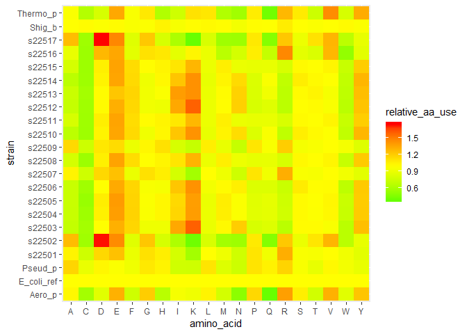
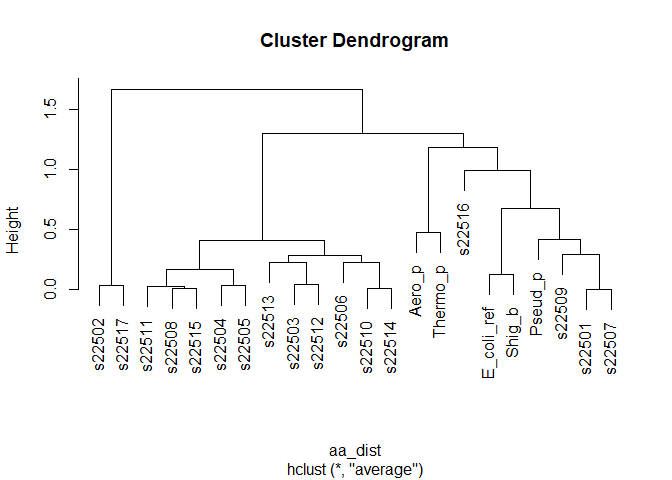
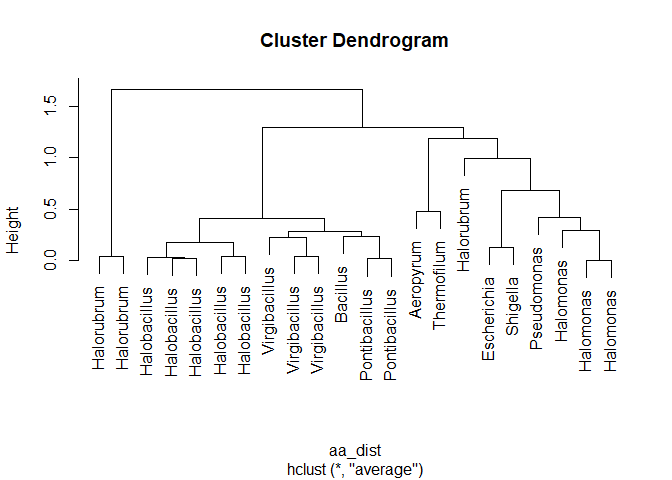
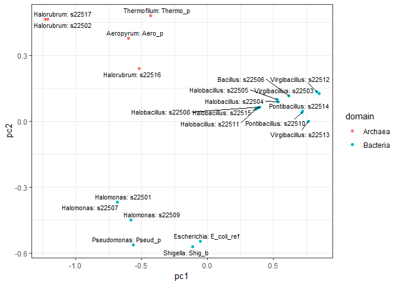
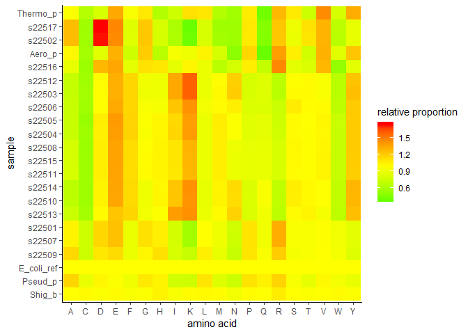

Week 4 Lab
----------

------------------------------------------------------------------------

> ### Homework for Next Week
>
> -   Fill in all of the answer blocks and coding tasks in this lab
>     notebook.
> -   Complete all tasks in the Homework section (bottom of the Rmd).
>     There are several small HW tasks this week, though the one to
>     focus on most is the brainstorming of three potential research
>     ideas.
>
> ### Learning Objectives
>
> -   Calculate amino acid patterns for our halophile genomes and
>     compare with E. coli and other prokaryotes.
> -   Be able to explain what a hierarchical clustering algorithm does,
>     and use R to apply clustering techniques to real data.
> -   Use the ggplot() function to generate high quality plots.

------------------------------------------------------------------------

### Loading source scripts

Before we begin, navigate to Canvas and download the `Lab4.RData` data
file into your `data/processed` folder and download the script
`utils_lab4.R` into to your `scripts` folder.

Run the script (after the data and script are in the right places).

``` r
source("../scripts/utils_lab4.R")
```

### Overview

Today we will begin to dive into comparative genomics. We will learn
some contemporary techniques for comparing amino acid usage among
species, and try to generate publication-worthy plots of our real data.
Prior research suggests that halophiles should have distinctive patterns
of amino acid usage, due to the effect of their highly saline
environments on protein stability. We will examine our data to see if
that’s the case, and use these results to characterize our diverse
strains into clusters that may vary in their level of halotolerance.

### Last week’s coding challenge – Aditi, Eldar, and Sarai

### Halophile protein composition – Reading review

Task 1 – sketching the analysis.

Using a blank sheet of paper, try to cartoon sketch the clustering
analysis we read about. What was the data, how was it processed, how was
it analyzed, what did the results show?

Task 2 – defining the hypothesis and evaluating their approach

Exactly what was their hypothesis? Was their analysis convincing?

### The genes in our data

Let’s remind ourselves of exactly what we have in our data. In Lab 2 we
examined the genbank (.gbk) files to find our 16S sequences. The genbank
files for each strain are an example of a genome **annotation**. Using
known genes from databases, in combination with computational
predictions based on start codons and sequences involved with promoter
sites, an algorithm can identify potential genes. When the sequence is
somewhat similar to a known gene in a different organism, these genes
can be annotated with useful information. This was the case with our 16S
sequences. In other cases, the algorithm may predict the location of a
gene but no matching sequences in any databases, labeling the potential
gene as “hypothetical protein” or “protein of unknown function”.

Let’s explore a different way to look at a genbank file. Here we’ll
introduce a tool in R (and many programming languages) for searching out
particular strings.

#### Loading a genbank file

``` r
annot_s22501 <- read_lines("../data/raw/22501_18_FS.gbk")

# head() is a nice function to view the first few lines 
# (though it didn't work well with the giant strings from previous weeks)

head(annot_s22501, n = 20)
```

    ##  [1] "LOCUS       NODE_1                472201 bp    DNA     linear       26-FEB-2019"
    ##  [2] "DEFINITION  Genus species strain strain."                                       
    ##  [3] "ACCESSION   "                                                                   
    ##  [4] "VERSION"                                                                        
    ##  [5] "KEYWORDS    ."                                                                  
    ##  [6] "SOURCE      Genus species"                                                      
    ##  [7] "  ORGANISM  Genus species"                                                      
    ##  [8] "            Unclassified."                                                      
    ##  [9] "COMMENT     Annotated using prokka 1.12 from"                                   
    ## [10] "            https://github.com/tseemann/prokka."                                
    ## [11] "FEATURES             Location/Qualifiers"                                       
    ## [12] "     source          1..472201"                                                 
    ## [13] "                     /organism=\"Genus species\""                               
    ## [14] "                     /mol_type=\"genomic DNA\""                                 
    ## [15] "                     /strain=\"strain\""                                        
    ## [16] "     CDS             complement(851..2293)"                                     
    ## [17] "                     /gene=\"cobQ\""                                            
    ## [18] "                     /locus_tag=\"22501_18_FS_00001\""                          
    ## [19] "                     /inference=\"ab initio prediction:Prodigal:2.6\""          
    ## [20] "                     /inference=\"similar to AA sequence:UniProtKB:P29932\""

This should look exactly like the genbank file looks when you open it in
a text editor. This is because the read\_lines() function (from the
`readr` package within the `tidyverse`) just makes a giant vector where
each entry is a string representing that line in the text file.

This seems like a clumsy format for our data, and it is. But it does
open up a few new tools. For one, every site that the annotation
software found as a potential protein-coding region has the label “CDS”
and the start and stop part of that contig’s DNA sequence. Let’s see how
many coding regions are found in each of our strains. We’ll walk through
strain 22501 together.

``` r
#grep() is a useful function that takes some pattern and finds all strings in a vector that match that pattern somewhere inside.

CDSrows_22501 <- grep(" CDS ",annot_s22501) # finding which rows have " CDS " in them

# this isn't the strings -- it's their indices (positions) in the overall
# vector of all the genbank file lines
head(CDSrows_22501)
```

    ## [1] 16 33 47 64 78 93

``` r
s22501_coding <- annot_s22501[CDSrows_22501]

head(s22501_coding)
```

    ## [1] "     CDS             complement(851..2293)" 
    ## [2] "     CDS             complement(2427..3038)"
    ## [3] "     CDS             complement(3041..4354)"
    ## [4] "     CDS             complement(4494..5258)"
    ## [5] "     CDS             complement(5258..6280)"
    ## [6] "     CDS             complement(6267..7148)"

``` r
length(s22501_coding)
```

    ## [1] 3040

What is `s22501` showing us? What did the line `annot1[CDSrows_22501]`
do? Take a minute to check in with your lab group.

**Pause here for a brief discussion**

Now let’s calculate this for each of our strains.

``` r
# uncomment and replace the line below with your strain name/number

# annot_s22501 <- read_lines("../data/raw/22501_18_FS.gbk")

# then use grep() to find the coding regions and count the total number
# of predicted protein-coding genes in your assembly.

# Add this to the google doc.
```

Why might we want this information? Again, check in with your lab group.

------------------------------------------------------------------------

**Pause here for a brief discussion**

------------------------------------------------------------------------

Having an annotation is powerful. We can already find potential genes of
interest, and start doing some comparisons. Without thinking so
explicitly, we did this when we BLASTed our 16S ribosomal RNA sequences.

Just to get you playing with genbank files, take a look into your genome
and find the gene for “ATP synthase subunit beta”. You could do this in
one of two ways. 1) open your gbk file in a text editor and search, or
2) use grep() with that name and see what you find in your R data. If
you use grep(), try to find a way to look at the next few lines as well,
to see what other information the annotation gives you.

Check in with your neighbors. You should all have found this gene. Why
is it present in all of the strains? What do you think this gene might
do? What are the “translation” lines telling you. Next week we’ll task
you with choosing another gene of your own interest and doing some
research, in preparation for a week 6 lab on annotation and gene
exploration.

------------------------------------------------------------------------

**Pause here for a brief discussion**

------------------------------------------------------------------------

### The amino acid profiles of our coding regions

The analysis we read about (Paul *et al.* 2008) didn’t work with
nucleotide data – which is pretty much the only data we’ve looked at so
far for our halophiles. Instead, they used amino acids. As we discussed
in Tuesday’s lecture, there is a direct correspondence between the the
amino acid sequence of a protein and the DNA sequence of the gene that
codes for that protein. Each triplet of DNA codes for a particular amino
acid (and the code is redundant; in many cases several triplets code for
the same amino acid). So, how can we get these data?

We’ve seen now that they are present in two ways in our genbank files.
We could use the contig number, start, and end site and pull the
sequence to translate it ourselves. Or we could pull the translations
directly from the genbank files. But this format, with lines in the file
arbitrarily separating out the sequence, is frustrating to work with. As
is almost always the case, someone has written an R package to solve
this problem (it’s called `biofiles`). However, the package is poorly
documented and finicky, so we are sparing you this annoying step.
Instead, you can work with the premade data `df_aa_long` and
`df_aa_wide`, which already have the amino acid compositions, defined in
a manner similar to Paul *et al.* These data are data.frames – the
preferred format for analyzing and plotting data in R. Note that we have
our 17 strains, as well as E. coli, 2 other Bacteria, and 2 other
Archaea. We’ve enriched the data a bit as well – we have our 16S genera,
domain of life, genomic gc content, a measure of salt-specific growth
rate, and two principal components. Don’t worry about exactly what those
mean yet. Let’s take a few looks at our data.

``` r
View(df_aa_wide)
```

Check in with your neighbors. Why are the proportions for the first E.
coli strain all equal to 1? And what is the final row? Those numbers
look way smaller! Think back to the methods in the Paul *et al.* paper.

------------------------------------------------------------------------

**Pause here for a brief discussion**

------------------------------------------------------------------------

### Heatmap as an initial view

Okay, let’s make a pretty plot. We’ll use the long version of the data,
which lets us more easily use plotting tools like ggplot().

``` r
ggplot(df_aa_long,aes(x = amino_acid, y = strain)) + 
    geom_tile(aes(fill = relative_aa_use)) 

ggplot(df_aa_long,aes(x = amino_acid, y = gc)) + 
    geom_tile(aes(fill = relative_aa_use)) 
```

Cool, we have a **heatmap**. These allow us to choose a discrete
(categorical) variable on the x-axis and y-axis, then plot some
continuous value (like the relative use of each amino acid) as a color.
You’ll notice a new aesthetic. `x` and `y` make intuitive sense, they
are how what we’ll use as x- and y-positions on the plot. `fill` on the
other hand, tells us to use a data column to fill in a color for each
row in the data. This is mainly useful when one or both axes are
categorical/discrete.

But these colors really aren’t that helpful. Let’s try to replicate the
plot in the paper.

``` r
ggplot(df_aa_long,aes(x = amino_acid, y = strain)) + 
    geom_tile(aes(fill = relative_aa_use)) + 
    scale_fill_gradient2(low = "green", mid = "yellow", high = "red", midpoint = 1)
```



The layer `scale_fill_gradient2()` let us set different colors for low
values, a midpoint, and high values. And we set the midpoint to 1, which
is equivalent to the E. coli profile.

Hopefully you’re starting to see how powerful ggplot can be. You can
have a lot of control over exactly what you plot and how it looks. Let’s
explore another approach to making varied figures from a data set. This
will feel very confusing at first, but stick with it, it’s a powerful
tool.

``` r
# we'll use some other tidyverse tools to slice into our data in 
# in different ways

# instead of strains, let's focus on the level of genera, since we
# expect similar values within a genus
genus_summary <- df_aa_long %>% # the pipe tool %>% lets us pass data 
    # to the next line
    group_by(genus,amino_acid) %>% 
    summarize(genus_mean = mean(relative_aa_use))
# because we used pipes, all these changes feed back to the top to 
# update the object "genus_summary".

# Uncomment next line to see what these data are
View(genus_summary)

# let's look by genus, instead of by strain, using our summarized data
ggplot(genus_summary, aes(x = amino_acid,y = genus)) + 
    geom_tile(aes(fill = genus_mean)) + 
    scale_fill_gradient2(low = "green", mid = "yellow", high = "red", midpoint = 1)
```

We can see that *Halorubrum* has a particularly striking pattern. It has
very high usage of D (Asp, Aspartic acid) and E (Glu, Glutamic acid) and
quite low usage of K (Lys, Lysine), M (Met, Methionine), and Q (Gln,
Glutamine). This partially echoes the results of Paul *et al.* However,
we don’t see the same patterns in the bacterial genera of our halophile
strains (e.g. Halomonas, Halobacillus, etc.). Hmm, let’s keep a
skeptical view towards that paper, and try to get more rigorous about
how we define “similarity”.

``` r
# Before we forget about group_by() and %>%, we should play around a bit

# Work with your group-mates

##################################
###  Your code here            ###
##################################

# create the same kind of summary as above, but by 
# domain (Bacteria vs. Archaea)


# use those data to make a heatmap similar to the one above


# create a summary of gc content by genus


##################################
##################################
```

### Computational thinking – hierarchical clustering

We can think of our amino acid data as 20 measurements for each of the
strains. Mathematically, we have a 20-dimensional vector to represent
each strain. How can we make sense of which strains are similar?

In your group, outline an algorithm for grouping together similar
species. Try to be as specific as possible. To start, think about how
you would first find the most similar pair of strains, out of all
possible pairs to compare. Then think about how you would build from
there. It might help to imagine you’re only working with one or two
measurements (e.g. just Asp and Lys proportions) to build the intuition
for how to decide what defines similarity.

------------------------------------------------------------------------

> #### Answer block – your clustering steps
>
> -   -   -   -   …

------------------------------------------------------------------------

**Pause here for a brief discussion**

------------------------------------------------------------------------

**10 minute break**

------------------------------------------------------------------------

### Performing clustering in R

It turns out that the clustering from the Paul *et al.* paper is
extremely easy to do in R.

``` r
# This is easier to perform with the wide data (unlike most tasks in R)

# Make sure you don't use the un-normalized E. coli data (row 23)

# We first calculate the pairwise distances between strains -- this is called 
# a distance matrix.

aa_dist <- dist(x = df_aa_wide[-23,1:20],method = "euclidean")

# the function hclust() performs the stepwise process we discussed above
# if we use the mean pairwise distance 

clusters <- hclust(aa_dist,method = "average")

# a plot by strain
plot(clusters, labels = df_aa_wide$strain[1:22])
```



``` r
# a plot by genus
plot(clusters, labels = df_aa_wide$genus[1:22])
```



Check in with your group-mates. What is this telling us? Are these
results similar to what we see in the Paul *et al.* paper? Why or why
not?

------------------------------------------------------------------------

**Pause here for a brief discussion**

------------------------------------------------------------------------

### Another approach – Principal Components Analysis

Your instructors will walk through a brief lesson on the board. With
hierarchical clustering we worked with values for all 20 of the amino
acid types. But if there are strong correlations in the data (for
example, a few amino acids that all tend to be high for some strains and
low for others), then we can try reduce down our scary, 20-dimensional
data, to something more manageable. Principal Components Analysis (PCA)
is one approach. The mathematical logic behind it is to find underlying
dimensions that vary the most in our data. Thinking about amino acids,
imagine that there’s a subset that either tend to all be commonly used
in some species and uncommonly used in others. You could re-express that
as a single number (on the all-high vs. all-low spectrum), reducing down
that set of many dimensions to a single dimension. The actual math is
slightly more complicated, and extremely elegant. But we’ll leave that
for now. We spared you the trouble (though it’s only a few lines in R),
and added two columns (pc1 and pc2) that give a 2-dimensional, reduced
version of our 20-dimensional data. This is nice, now we can view the
data as points in 2-dimensional space: a world in which we are
comfortable.

``` r
ggplot(df_aa_wide,aes(x = pc1, y = pc2)) + 
    geom_point()

ggplot(df_aa_wide,aes(x = pc1, y = pc2, color = strain)) + 
    geom_point()

ggplot(df_aa_wide,aes(x = pc1, y = pc2)) + 
    geom_point() + 
    geom_text_repel(aes(label = strain))
```

Check in with your group-mates. Are there any apparent clusters in these
data? How do they compare to the hierarchical clustering plot above?

### Visualizing data – the graph-a-thon

For the remainder of lab, your task is to explore the data, and as a lab
group come up with one really excellent plot. At the end of lab we will
vote on our top two favorites, based on the criteria: 1) the plot tells
a story, convincingly representing the intended pattern, 2) the plot is
visually pleasing, 3) the plot is data rich, conveying as much data as
it can while being clear.

In addition to what we’ve examined so far, we also have our GC content
data from last week and some rough growth rate data. That column,
`growth`, is the ratio of the growth rate of each sample in the highest
salinity media to the lowest salinity media. A higher number corresponds
to samples that grew proportionally better in higher salt, though only a
few samples actually grew better in higher salinity (all the media were
pretty salty to begin with).

This reference might help you think about ways to look at the data with
ggplot.
<a href="https://www.r-graph-gallery.com/portfolio/ggplot2-package/" class="uri">https://www.r-graph-gallery.com/portfolio/ggplot2-package/</a>

A few fun examples to get you thinking: 1) using geom\_text\_repel() and
paste() to show non-overlapping labels of genus and strain, plotting by
the principal components, 2) mutating the data to order the strain names
in a more useful way, then showing our original tiles with better
clusters.

``` r
# note that we can do some cool things inside our aesthetics
# here I added points that are colored by domain
# and made good labels that have both strain and genus
# by setting the aesthetic inside of the geom layers
# the color doesn't also affect the text 
# you could try putting it into the first line to see what happens
ggplot(df_aa_wide,aes(x = pc1, y = pc2)) + 
    geom_point(aes(color = domain)) + 
    geom_text_repel(aes(label = paste0(genus,": ",strain)), size = 3)+
    theme_bw()
```

    ## Warning: Removed 1 rows containing missing values (geom_point).

    ## Warning: Removed 1 rows containing missing values (geom_text_repel).



``` r
# here we're making a new column that re-orders the strains
df_aa_long %>%
    mutate(strain_sort = fct_reorder(strain,pc2)) %>% # this re-ordered the 
    # strains by their value for pc2 (which seemed to seperate the groups well)
    ggplot(aes(x = amino_acid, y = strain_sort)) +
    geom_tile(aes(fill = relative_aa_use)) + 
    scale_fill_gradient2(low = "green", mid = "yellow", high = "red",
                         midpoint = 1, name = "relative proportion") +
    labs(x = "amino acid" , y = "sample") + 
    theme_classic()
```



``` r
##################################
###  Your code here            ###
##################################

# Include all your code for the plots you make.
# This is a fundamental rule of reproducible research -- anyone
# should be able to see exactly how you analyzed your data and 
# made your plots.

##################################
##################################
```

### Exit ticket – written on an index card

Thinking back to the Paul *et al.* paper, what’s a follow-up to perform
a more refined version of this amino acid analysis. You could think
about adding more samples (what kinds of additional samples would you
want?), changing how you normalize (does normalizing by E. coli make
sense?), using other methods for clustering, or anything else you can
think of.

Homework
--------

### Finish up labwork (1 pt)

Make sure that any short responses or coding snippets above have been
filled in with your work.

### Reading and response (3 pts)

#### Part 1. Playing a game

Navigate to the phylo online alignment game.
<a href="https://phylo.cs.mcgill.ca/play.html" class="uri">https://phylo.cs.mcgill.ca/play.html</a>

Spend 30 minutes playing, performing some alignments of genes (to help
improve genomic data).

Respond to the following questions:

1.  How is the quality/score of an alignment calculated for this game?
    Why might gaps have a bigger penalty than mismatches?

2.  We can think of an alignment score as the measure of similarity
    between two DNA sequences. With this in mind, explain how you might
    perform hierarchical clustering on a set of DNA sequences. (This is
    a common way to build an evolutionary tree of relatedness, comparing
    samples using a gene that evolves slowly like the 16S rRNA gene.
    We’ll take this on in more detail in Lab 5.)

------------------------------------------------------------------------

> #### Part 1: PHYLO (2-3 sentences each)
>
> Q1.
>
> Q2.

------------------------------------------------------------------------

#### Part 2. Coming up with potential final project questions

We will go over the final project in more detail next week. But it’s
never too early to start generating potential ideas. To kick things off,
we put together some example questions that might lead to an interesting
project.

<a href="https://docs.google.com/document/d/1rjcClT2NqQ1sNhuykrQ_DwWl-MAMDrV_OezCke9cNvs/edit?usp=sharing" class="uri">https://docs.google.com/document/d/1rjcClT2NqQ1sNhuykrQ_DwWl-MAMDrV_OezCke9cNvs/edit?usp=sharing</a>

There are a few things to keep in mind:

-   The degree of quantitative-ness of the projects might vary quite a
    bit. That’s okay, but you’re expected (with our help) to perform
    some kind of quantitative analysis on your resulting data. You’ll be
    surprised how many good questions can be answered with statistical
    methods that are really just careful counting and comparing.
-   This is not restricted to your sample – you can use all the class
    data and pull in comparison samples from databases.
-   If you end up using a pre-existing tool (e.g. for predicting protein
    function), you should be able to clearly explain the computational
    logic of the algorithm.
-   This is our first round of brainstorming, so don’t worry about an
    idea being silly or naive. But do make sure you’ve thought out the
    logic of the idea. We’ll spend the next 3 weeks helping you refine
    your ideas, and we’ll put together groups working with similar
    methods so that you also have peer support.

**Be ready to share these ideas with your classmates next week. We will
do a speed-pitching session for rapid-fire feedback and
cross-pollination of ideas in Lab 5**

------------------------------------------------------------------------

> #### Part 2: your three potential questions/hypotheses (2-3 sentences each)
>
> Question 1.
>
> Question 2.
>
> Question 3.

------------------------------------------------------------------------

#### Part 3. Setting up a RAST account

This will only take a minute. Navigate to the website for an annotation
tool called RAST:
<a href="http://rast.nmpdr.org/?page=Register" class="uri">http://rast.nmpdr.org/?page=Register</a>.

Register, using an email address that you’re comfortable sharing with
the class. **Forward your confirmation email to Dr. Furrow
(<a href="mailto:refurrow@ucdavis.edu" class="email">refurrow@ucdavis.edu</a>).**

### Coding (1 pt)

Your coding task is small this week so that you can focus on coming up
with potential research questions.

The task: turn a nice-looking version of the heatmap plot into a
function. If interested, you can choose a different type of plot from
your exploration today. Your heatmap should include: useful labels for
the x- and y-axis, a title, a good color scheme, and a nice theme.

This is an approach that is quite useful when you’re making lots of
plots, or trying to make a very nicely formatted plot for publishing in
a journal article.

``` r
my_plot <- function(data)
{
    # data should be the long-formatted version, which we 
    # need for heatmaps
    
    # now just call your ggplot with the layers and options that
    # work best for you
    
    # but remember that the data is now called "data", not df_aa_long
}

# uncomment the next line and run to view your plot

#my_plot(df_aa_long)
```

Code Appendix
-------------

This includes all of the inline code you wrote in the coding sections
while you were exploring in this week’s lab. You don’t need to run
anything – it will automatically fill itself in.

``` r
# uncomment and replace the line below with your strain name/number

# annot_s22501 <- read_lines("../data/raw/22501_18_FS.gbk")

# then use grep() to find the coding regions and count the total number
# of predicted protein-coding genes in your assembly.

# Add this to the google doc.
# Before we forget about group_by() and %>%, we should play around a bit

# Work with your group-mates

##################################
###  Your code here            ###
##################################

# create the same kind of summary as above, but by 
# domain (Bacteria vs. Archaea)


# use those data to make a heatmap similar to the one above


# create a summary of gc content by genus


##################################
##################################


##################################
###  Your code here            ###
##################################

# Include all your code for the plots you make.
# This is a fundamental rule of reproducible research -- anyone
# should be able to see exactly how you analyzed your data and 
# made your plots.

##################################
##################################

my_plot <- function(data)
{
    # data should be the long-formatted version, which we 
    # need for heatmaps
    
    # now just call your ggplot with the layers and options that
    # work best for you
    
    # but remember that the data is now called "data", not df_aa_long
}

# uncomment the next line and run to view your plot

#my_plot(df_aa_long)
```
