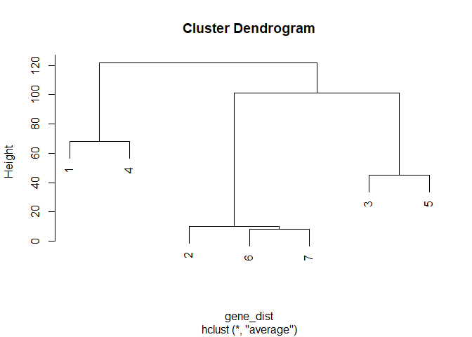
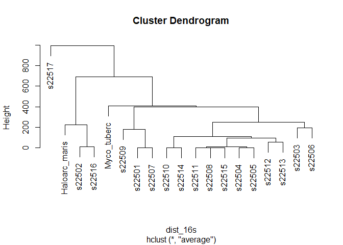
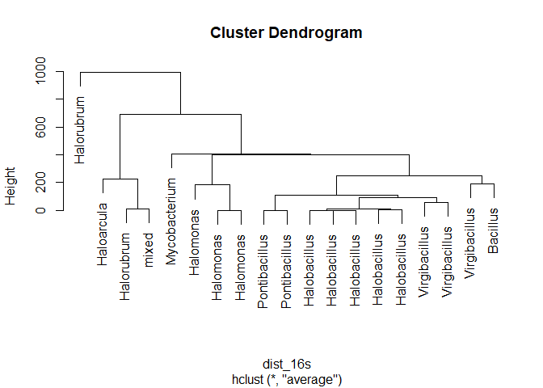
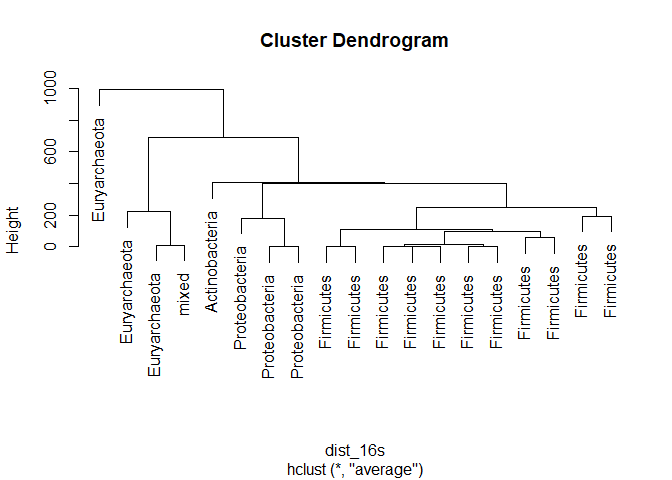
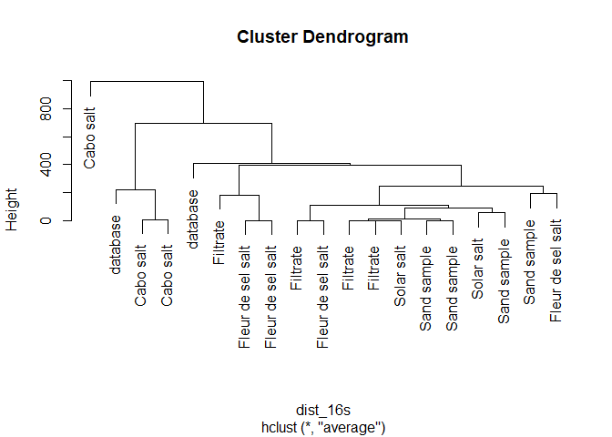
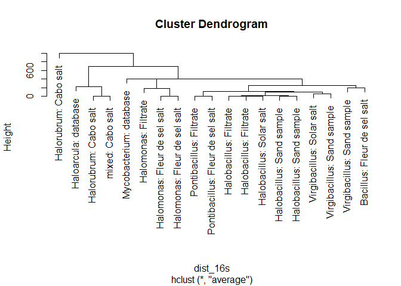

Week 5 Lab
----------

------------------------------------------------------------------------

> ### Homework for Next Week
>
> -   Fill in all of the answer blocks and coding tasks in this lab
>     notebook.
> -   Complete all tasks in the Homework section (bottom of the Rmd).
>
> ### Learning Objectives
>
> -   Build a phylogenetic tree using a distance matrix.
> -   Relate a phylogenetic tree to a potential history of the
>     evolutionary relatedness of species in the tree.
> -   Use simulations of the neutral evolution of a gene across multiple
>     organisms to build intuition about best practices for phylogeny
>     building.
> -   Refine your potential project ideas and get started with some
>     background research.

------------------------------------------------------------------------

### Loading source scripts

Before we begin, navigate to Canvas and download the `Lab5.RData` data
file into your `data/processed` folder and download the script
`utils_lab5.R` into to your `scripts` folder.

Run the script (after the data and script are in the right places).

``` {.r}
source("../scripts/utils_lab5.R")
```

### Overview

Today we have three main goals: 1) make sense of how we assess the
evolutionary relatedness of different organisms, 2) get some practice
with **simulation** as a powerful tool for building intuition about how
an analysis works, 3) start laying the foundation for our final
projects.

### Last week's coding challenge -- Dr. Furrow will review

Because this coding task was so low on individual input, Dr. Furrow will
present a short example.

``` {.r}
load("../data/processed/Lab4.RData")

my_plot <- function(data)
{
    genus_summary <- data %>%
    group_by(genus,amino_acid) %>% 
    summarize(genus_mean = mean(relative_aa_use),
              pc2_mean = mean(pc2)) %>%
    ungroup() %>%
    mutate(genus = fct_reorder(genus,pc2_mean))
    
    ggplot(genus_summary, aes(x = amino_acid,y = genus)) + 
    geom_tile(aes(fill = genus_mean)) + 
    scale_fill_gradient2(low = "yellow", mid = "darkturquoise", high = "darkorchid4", midpoint = 1, name = "relative use", breaks = c(0.5,1,1.5)) + 
    labs(x = "amino acid" , y = "", title = "Amino acid profiles of 11 microbial genera") + 
    theme_minimal()
}


my_plot(df_aa_long)
```

### Phylogeny review

After a short review, instructors will put a distance matrix up on the
board. Your task, in your groups, is to build a phylogeny from these
distances. Talk with your group about exactly what information the
phylogeny is presenting.

------------------------------------------------------------------------

**Pause here for discussion**

------------------------------------------------------------------------

### A detour into modeling

Your instructors wrote a small function, `evo_sim()`, to simulate how
genomes diverge as species split and evolve seperately.

We'll practice our coding this week in a slightly different way -- by
dissecting this code. Let's begin by running the function.

``` {.r}
set.seed(17)
populations <- evo_sim(mutation = 5*10^-7, gene_length = 1500, gen = 10^5)
```

    ## [1] "Population 1 has split into 1 and 2 at generation 4636"
    ## [1] "Population 2 has split into 2 and 3 at generation 21501"
    ## [1] "Population 1 has split into 1 and 4 at generation 42773"
    ## [1] "Population 3 has split into 3 and 5 at generation 63508"
    ## [1] "Population 2 has split into 2 and 6 at generation 85928"
    ## [1] "Population 6 has split into 6 and 7 at generation 88331"

We did something weird. I wanted you all to get the same result, but
this is a simulation of random processes like mutation and species being
separated. To achieve this, I used a function called `set.seed()`, which
sets a starting point for the (pseudo)random-number generator that R
uses. With the seed set, the next sequence of random numbers you
generate will be identical for anyone who has set that seed. This is a
nice tool to remember if you want to use a random simulation but still
share a particular example with other people.

Okay, so what is our output? If you look in your global environment,
you'll see that `species` is a data.frame, our favorite data format. It
tracks the genome of each species, as well as generation time when each
new species originally split off, and a string that explains what
happened at each splitting event. Let's work backwards. **Thinking about
phylogenetic trees, try to to draw a tree of relatedness (in the manner
of hierarchical clustering) from the seven species above.** Keep in mind
that more recent splits should have less time to accumulate differences
in the genome through mutation.

``` {.r}
View(populations)
```

**Pause here for discussion**

Let's formalize this. Last week you came up with several great ideas for
defining distance between the amino acid profiles. Now we have DNA
sequences. They aren't numbers, so distance isn't as obvious. But the
*Phylo* game you played as part of your homework hints at the approach.
We can think about distance between sequences equivalently to the
quality of the best alignment between two sequences. The more
substitutions and gaps, the more "distant" the two sequences are (lower
alignment scores).

R has already implemented this, thank goodness. We'll start out quick
and oversimplified, using something called Levenshtein distance, which
adds one point to the distance for each mismatch, gap, and gap
extension. Basically, each change (either a single nucleotide insertion,
deletion, or substitution) adds 1 additional distance unit.

Our favorite package, `Biostrings`, already has this tool implemented
for us with the function `stringDist()`. Let's try it out on our data,
and see if the results match our prediction.

``` {.r}
gene_dist <- stringDist(populations$genomes)

gene_dist
```

    ##     1   2   3   4   5   6
    ## 2 130                    
    ## 3 126 101                
    ## 4  68 117 113            
    ## 5 125 101  45 111        
    ## 6 131  11 103 118 102    
    ## 7 129   9 101 116  98   8

Like last week, this built a distance matrix. Don't worry about the
lingo, it's just a way to represent the distance between each pair of
sequences. Here it uses the number of changes in the genome sequences as
the distances.

``` {.r}
clusters <- hclust(gene_dist,method = "average")
plot(clusters)
```



*What do you think? Does that match your prediction? Check in with your
group and analyze.*

#### Dissecting the simulation

As a class we will walk through the function `evo_sim()`. It doesn't use
anything fancier than the tools we've already learned, and it can give
some insight about exactly what our model is doing.

Double-click on the function `evo_sim()` in your global environment.
This will show you the source code. The code looks long, but it's mostly
comments.

------------------------------------------------------------------------

**We will work through the simulation together.**

------------------------------------------------------------------------

#### Choosing the best gene(s) for a phylogeny

Before we get into our real data, let's play around with the simulation
a bit.

With your group, try out a few more simulations. You'll need to use
`set.seed()` if you all want to get the same result. A few things to
look at.

1.  Try out some higher mutation rates, like 10\^-6, or 10\^-5, or even
    larger. Check out some really low mutation rates as well
    (e.g. 10\^-10).

2.  Try out some different "gene" lengths (but don't go longer than
    10000 or the distance matrix calculation will take forever).

3.  Try out other generation times, but don't go higher than 5\*10\^5
    unless you want a ton of species and a very long simulation. Varying
    this parameter might not be as interesting.

``` {.r}
# store some of your examples of simulations (including the set.seed() lines)
##################################
###  Your code here            ###
##################################


##################################
##################################
```

------------------------------------------------------------------------

> #### Answer block -- Simulations as analogy.
>
> Q1. What happens when mutation rate is very high? What does the
> distance matrix from `stringDist()` look like? Does the phylogeny
> predicted by clustering always match the actual history from the data?
>
> Your response:
>
> Q2. Is it possible to compensate for a higher mutation rate by
> adjusting the length of the sequences that you are comparing? In
> practical terms, what would this mean for building a phylogeny with
> real data?
>
> Your response:
>
> Q3. Let's connect this to our halophile genomes. We have both Archaea
> and Bacteria. With that in mind, would we want a high or low mutation
> rate for the gene(s) we use to build a phylogeny? What if we wanted to
> identify the relatedness of 5 different strains of *Halomonas
> utahensis* -- would the 16S rRNA gene still be a good choice?
>
> Your response:

------------------------------------------------------------------------

------------------------------------------------------------------------

**Pause here for a class discussion.**

------------------------------------------------------------------------

#### A better version of stringDist

In the homework, we saw that Phylo didn't give equal weight to gaps and
mismatches. It assigned a bigger penalty to a new gap opening and
smaller penalties to gap extensions (the size of an insertion/deletion)
and mismatches. This is actually easy to handle with `stringDist`. We
can specify a substitution matrix that gives the exact scores. (And we
could get even more complicated and make different mismatches worth
different amounts -- it turns out that mutations from A\<-\>G or C\<-\>T
are signficantly more common than any others.)

Let's create a more sophisticed distance calculation, then get into our
real data. Note that it won't matter for our simulation, since our
simulation didn't have insertions or deletions occurring.

``` {.r}
# we'll make a matrix that assigns a -1 for each mismatch
sub_mat <- nucleotideSubstitutionMatrix(match = 0, mismatch = -1, baseOnly = TRUE)

# then we can use that matrix, combined with penalties for gap openings
# and gap extensions
gene_dist <- stringDist(populations$genomes, method = "substitutionMatrix",
                        substitutionMatrix = sub_mat,
                        gapOpening = 3, gapExtension = 1)

clusters <- hclust(gene_dist, method = "average")


plot(clusters)
```


Nothing should be different, because the distance matrix will be
identical to the Levenshtein distance we used earlier. But it might make
a difference with our real data. For example, our 16S rRNA gene is not
the same length for every sample. That means there must have been some
insertions or deletions at some point along the way. This allows us to
penalize more for insertions and deletions than for single base-pair
substitutions.

### Working with our data

When we BLASTed the 16S data before, we got a sense of the most closely
related species, but it wasn't easy to understand the relationships of
all of our samples. Building a phylogenetic tree that incorporates all
the data at once will provide a different picture. The coding here will
not be profound; we already have all the tools.

Let's begin by building a tree with our 16s sequences. First, a look at
our data.

``` {.r}
View(phylogeny_genes)
```

We have our 17 samples, and two extra species. One is an Archaeon,
*Haloarcula marismortui*, that is fairly closely related to
*Halorubrum*. The other is a Bacterium, *Mycobacterium tuberculosis*.
This is the species that causes the disease tuberculosis. For
phylogeny-building, it can help to have a closely related outside
species to better infer the relationships between species. This allows a
better chance at figuring out what the original DNA sequence of the
ancestor was. However, none of this matters that much when we're
building a tree across both Bacteria and Archaea -- these are different
Domains of life and only share an ancestor incredibly deeply back in
time.

``` {.r}
# making a distance matrix
dist_16s <- stringDist(phylogeny_genes$seq_16s, method = "substitutionMatrix",
                        substitutionMatrix = sub_mat,
                        gapOpening = 3, gapExtension = 1)

# You might want to check out the distance matrix
# Uncomment the next line to view the matrix in the console
# dist_16s

clust_16s <- hclust(dist_16s, method = "average")


plot(clust_16s, labels = phylogeny_genes$strain)
```



``` {.r}
# To get more descriptive, let's view the plot with some different labels
plot(clust_16s, labels = phylogeny_genes$genus)
```



``` {.r}
plot(clust_16s, labels = phylogeny_genes$phylum)
```



``` {.r}
plot(clust_16s, labels = phylogeny_genes$source)
```



``` {.r}
plot(clust_16s, labels = paste0(phylogeny_genes$genus,": ",phylogeny_genes$source))
```



**Does everything about this tree make sense?** Remember that species in
the same genus should all be clustered together on the tree.

Looking back at the notes in the google doc might get you thinking.
<https://docs.google.com/spreadsheets/d/1AH2dUxqbX-yTVgs_x191YZiRu33ZxCfYKrPmFfsMzbQ/edit?usp=sharing>

------------------------------------------------------------------------

**Pause here for a class discussion.**

------------------------------------------------------------------------

Some of our samples didn't have the ATP synthase subunit beta gene that
we discussed last week. So your instructors found a different conserved
gene that was present and complete in all the samples. That gene is
*infB*, and it codes for a translation initiation factor. Basically, the
cell cannot make any proteins without some copies of the infB protein.
So this is a critical gene that will have changed in sequence only very
slowly through time.

Your task now is to build a phylogeny using the same approach, but with
the *infB* gene instead. Then you'll build a tree using both genes at
once.

``` {.r}
# Your task, build the same tree using the infB gene.
# then build a tree combining data from both genes.

##################################
###  Your code here            ###
##################################

# building a tree from infB


# building a tree from both genes
# to build a tree using information from both genes, 
# let's take the easiest approach.

# define a new distance matrix that is the sum of the 
# distance matrix for 16S and infB
# now use it to cluster and plot


##################################
##################################
```

Some questions to think about:

1.  You do not get the same tree. What are some differences?

2.  Is one tree better than the other? Why or why not? How does the
    2-gene tree compare?

3.  With all these phylogenies in mind, what are some questions you
    have? Are there any unexpected patterns? How does this relate to the
    source from which the sample came? (Your instructors don't have the
    answers -- we have questions as well.)

------------------------------------------------------------------------

**Pause here for discussion and then a 10-minute break.**

------------------------------------------------------------------------

### Uploading an annotation to RAST

Now that you've set up an account on RAST, go to the upload page (under
Your Jobs) <http://rast.theseed.org/FIG/rast.cgi?page=Upload>

Upload the FASTA file for your sequence. RAST will perform an automatic
annotation, though it might take a few days.

### Final project overview

We will distribute a more detailed project prompt on Tuesday. But here's
an outline.

**Final product:** A new analysis of our genomic data as both a written
report and an oral presentation.

**Timeline:**

Week 5 -- Pitching session with peers to brainstorm and refine ideas

Week 6 -- Small group check-in and mentored open work time for second
half of lab

Week 7 -- Submit initial written proposal (5%)

Week 8 -- Present an outline of an analysis for peer review session (5%)

Week 9 -- Submit initial draft (5%) for peer review session

Week 10 -- Submit finalized written draft (15%) and prep for oral
presentation

Final Exam period -- give oral presentation (10%)

### Idea pitching

Take 5 minutes to get your thoughts together. Then we'll get into groups
and have everyone give two 2-minute pitches, one for each of your top
two ideas. *Be sure to mention the main question, why it's interesting,
and what tools/data you might need to do the analysis.*

------------------------------------------------------------------------

> #### Answer block -- Project ideas
>
> Reflecting on the pitching sessions, use this space for some notes
> about what you need to do next to refine your idea(s). Keep the
> following questions in mind.
>
> What is my question? Do I have a good sense of what I might expect to
> find?
>
> Do I have all the data I need? Will I need to download any other
> genomes or other useful comparative information?
>
> What kind of analyses am I doing? Are there pre-existing tools
> available online or to download? Is it easy to understand the
> conceptual idea of what they're doing?
>
> What data processing and other coding will I need to do in R? What
> might I need to learn?
>
> What kinds of results will I present? Figures? Tables? Conceptual
> illustrations?
>
> YOUR NOTES:

------------------------------------------------------------------------

### End of class -- 10 minutes for mid-quarter feedback.

Please take this anonymous, online survey to help us make changes to
maximize your learning in the second half of the quarter. Thanks!
<https://forms.gle/57nU3VsK992N4VA4A>

------------------------------------------------------------------------

Homework
--------

### Finish up labwork (1 pt)

Make sure that any short responses or coding snippets above have been
filled in with your work.

### Reading and response (3 pts)

A team led by Professor Marc Facciotti recently published a rich
analysis of a large set of Halophile genomes. The paper is here:
<https://journals.plos.org/plosgenetics/article?id=10.1371/journal.pgen.1004784>,
and is on Canvas as a PDF.

If you tried to read this paper from start to finish, you would be
exhausted and confused (and angry that we had set you on such a cruel
task). But it lays out many potential analyses that we could do on our
data. We will loop back to this paper several times and refine our
understanding. This week we'll start by:

-   Reading the Abstract, Author Summary, and Introduction,
-   Reading the section *Insights into salt adaptation from the
    haloarchaeal core genome*
-   Skimming the titles of all the sections to see the breadth of
    analyses they performed.

This text will be full of jargon and will feel overwhelming. **It's okay
that you don't understand every word. Focus on the bigger picture, and
use the reading questions below to help guide you.**

With this reading in mind, answer the following questions:

1.  The term *osmoadaptation* comes up several times. What does it mean?
    Why is it relevant for halophiles?

2.  In the section about insights into salt adaptation, the authors
    discuss several groups of protein families that are part of the core
    genome (found in all 80 genomes in the study). Pick two examples
    (e.g. stress response, translation/transcription, etc.) and briefly
    summarize their findings and why they think the families might be
    relevant for salt adaptation.

3.  After skimming the titles of different sections, did you find any
    that related to one of your potential research questions? If so,
    skim one section while keeping in mind how you might use our data in
    a similar way. If not, pick a section and coarsely read for the big
    picture of what they did. In either case, *write the name of the
    section you've chosen, and write out a brief (3+ sentences) outline
    of the steps you might take to analyze our data in a similar way.*

------------------------------------------------------------------------

> #### Answer block -- HW reading questions.
>
> Q1 (2-3 sentences).
>
> Q2 (3-4 sentences).
>
> Q3 (3+ sentences).

------------------------------------------------------------------------

### (Pseudo)Coding (1 pt)

In lab today we walked step-by-step through the function `evo_sim()`.
Your HW (pseudo)coding task is to propose a modification of the function
to add more realism. That might include a more realistic model of
mutation (not all changes are equally likely), adding horizontal gene
transfer events, adding extinction events, or anything else that seems
interesting.

*Write out the detailed steps of how you would change the code to
incorporate this modification. In addition, explain how the change might
affect the interpretation of the simulated phylogenetic trees. In
particular, how will the modification affect the accuracy of our
inferences using simple, distance-based clustering?*

You don't actually have to write the code -- I've done it for many of
these and it can be a doozy.

------------------------------------------------------------------------

> #### Answer block -- Your simulation modification (5-7 sentences)

------------------------------------------------------------------------

Code Appendix
-------------

This includes all of the inline code you wrote in the coding sections
while you were exploring in this week's lab. You don't need to run
anything -- it will automatically fill itself in.

``` {.r}
# store some of your examples of simulations (including the set.seed() lines)
##################################
###  Your code here            ###
##################################


##################################
##################################
# Your task, build the same tree using the infB gene.
# then build a tree combining data from both genes.

##################################
###  Your code here            ###
##################################

# building a tree from infB


# building a tree from both genes
# to build a tree using information from both genes, 
# let's take the easiest approach.

# define a new distance matrix that is the sum of the 
# distance matrix for 16S and infB
# now use it to cluster and plot


##################################
##################################
```
