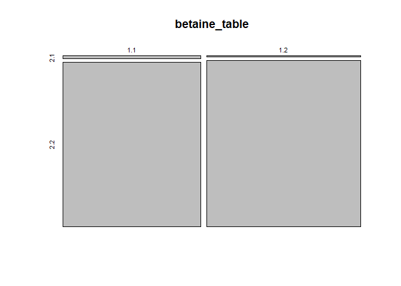

Week 6 Lab
----------

------------------------------------------------------------------------

> ### Homework for Next Week
>
> -   Fill in all of the answer blocks and coding tasks in this lab
>     notebook.
> -   Complete all tasks in the Homework section (bottom of the Rmd).
> -   Complete both parts of the Final Project Proposal (the slides due
>     Monday night and the written proposal due Wednesday night).
>
> ### Learning Objectives
>
> -   Generate a core gene set from a genbank file.
> -   Determine whether a particular function/process is represented by
>     more genes than expected in a particular genome.
> -   Have a specific plan for turning your project idea into a proposal
>     for next week.

------------------------------------------------------------------------

### Loading necessary libraries

    suppressPackageStartupMessages(suppressWarnings(library(tidyverse)))

### Overview

Today we will build our own “core gene sets” from our genomes, echoing
the approach of Becker et al. from the paper we saw this week. Then we
will explore a small analysis you can perform to check whether certain
pathways or functions seem to have more genes than expected in our
assembled genomes (a functional enrichment analysis). This could reveal
potential routes to adaptation to the halophilic lifestyle. Finally, we
will use the last hour of lab to discuss project ideas with peers and
instructors, in preparation for next week’s proposal.

### Last week’s coding challenge – Celine, Jordan, and Julia

------------------------------------------------------------------------

### Your mid-quarter feedback

Your feedback was constructive and sophisticated. Thank you! Below is a
short summary.

*Going well:* you are enjoying getting comfortable with R, and getting
to explore real data. The combination of new skills with practical
applications makes the concepts and coding feel relevant.

*Ideas for improvement:* a cheat sheet of common functions, more review
of tools and results from previous labs, more varied learning (more
visuals for the coding, for example) and more breaks, quieter lab room,
smaller problem-set style coding tasks for homework.

*Pacing:* some labs feel fast, there may be opportunities to narrow the
focus and dive deeper.

*Our plan for the second half:*

-   Later labs will cover fewer new topics, but still leave plenty of
    time to explore,
-   We are beginning to build a reference list with common R functions
    and examples of how they work,
-   As we transition to more independent work, we will try to identify
    opportunities for reviews, check-ins, and ways to mix up the lab.

### Lab 5 recap

We’ll take a quick look at our phylogenies. We might not have stressed
it enough, but these phylogenies are real, meaningful data – this is the
best attempt anyone has made at building a phylogeny from this set of
organisms!

### Joel will introduce the Resource Announcement paper

### Lecture and reading recap

Tuesday’s lecture set us up perfectly for today’s lab. Let’s recap.

Task 1 – What is a “core gene set”?

Come up with a step-by-step process for generating this set of genes
from our samples, and write it out either as a conceptual diagram or a
bulleted list. Remember that we already have an annotation that has
identified all the predicted genes (and has their names) for each
genome.

Task 2 – What did Becker et al. find in their core set?

Check in with your group about the kinds of genes they found in the core
set. We will write up on the board to summarize.

### Part 1 – getting our own core gene set

Because we already have our annotations, this is really just a
book-keeping challenge. We’ll use this to get some practice with R tools
we’ve already used, combined with a few new tricks.

The logical overview:

1.  For each genome (from the genbank files), make a vector of the names
    of all the known genes that were identified.
2.  Find the (potentially quite small) subset of the genes are found in
    all 17 of the vectors (all 17 genomes)

Let’s begin by loading the files. They’re big, so we can save some
memory by not loading all of them at the same time. We’ll use a
time-saving trick with a function called `list.files()`, but bear in
mind that this is not necessary, just useful for dealing with many files
at once.

    # we're loading a lot of files.  Instead of having to write them all out, let's
    # use a cool trick.

    # list.files() lets you find every file in a folder that has a certain pattern.
    # The pattern can occur anywhere... it could be a name, the name of the 
    # filetype, or any pattern that occurs in the file's name

    # we'll find the genbank file names by looking for ".gbk" in the file names
    names = list.files(path = "../data/raw/",pattern = ".gbk")

    # here's a cool trick we can do with paste.  For a vector, paste() or paste0()
    # by default can paste something additional onto each entry in the vector. 

    # to get the full paths, let's paste the path "../data/raw/" to the file
    # names

    path_full <- paste0("../data/raw/",names)

    # to see what we have, here are the first three strings in our vector
    path_full[1:3]

    ## [1] "../data/raw/22501_18_FS.gbk"   "../data/raw/22502_06_Cabo.gbk"
    ## [3] "../data/raw/22503_08_Sand.gbk"

    # why is this useful?  Now you can use an entry in that vector instead of 
    # having to write everything out.

    example <- read_lines(path_full[2])
    # this is equivalent to writing
    example <- read_lines("../data/raw/22502_06_Cabo.gbk")

    # this is a reminder of what our data look like -- it's just the 
    # genbank file formatted so that each line is a string in a vector
    example[1:32]

    ##  [1] "LOCUS       NODE_1                341033 bp    DNA     linear       26-FEB-2019" 
    ##  [2] "DEFINITION  Genus species strain strain."                                        
    ##  [3] "ACCESSION   "                                                                    
    ##  [4] "VERSION"                                                                         
    ##  [5] "KEYWORDS    ."                                                                   
    ##  [6] "SOURCE      Genus species"                                                       
    ##  [7] "  ORGANISM  Genus species"                                                       
    ##  [8] "            Unclassified."                                                       
    ##  [9] "COMMENT     Annotated using prokka 1.12 from"                                    
    ## [10] "            https://github.com/tseemann/prokka."                                 
    ## [11] "FEATURES             Location/Qualifiers"                                        
    ## [12] "     source          1..341033"                                                  
    ## [13] "                     /organism=\"Genus species\""                                
    ## [14] "                     /mol_type=\"genomic DNA\""                                  
    ## [15] "                     /strain=\"strain\""                                         
    ## [16] "     CDS             complement(264..797)"                                       
    ## [17] "                     /locus_tag=\"22502_06_Cabo_00001\""                         
    ## [18] "                     /EC_number=\"3.1.4.-\""                                     
    ## [19] "                     /inference=\"ab initio prediction:Prodigal:2.6\""           
    ## [20] "                     /inference=\"similar to AA sequence:UniProtKB:P75349\""     
    ## [21] "                     /codon_start=1"                                             
    ## [22] "                     /transl_table=11"                                           
    ## [23] "                     /product=\"Putative metallophosphoesterase MG207 homolog\"" 
    ## [24] "                     /translation=\"MLVVVSDTHAREESKLQGRTAAAVREAELVIHAGDFYHEPVLDA"
    ## [25] "                     FRSAAASLRAVYGNNDDAAIRDRVPEVRTVEYAGVRFAVTHRHRSGDTGLVMLGRGRD" 
    ## [26] "                     ADAVICGHSHRPRFDDSGGLPILNPGSHAQPRGNRPAHAELTPVGDERGSALDGKLVT" 
    ## [27] "                     PDGKVFEEFRIEGGGAE\""                                        
    ## [28] "     CDS             complement(1212..2195)"                                     
    ## [29] "                     /gene=\"dnaX_1\""                                           
    ## [30] "                     /locus_tag=\"22502_06_Cabo_00002\""                         
    ## [31] "                     /EC_number=\"2.7.7.7\""                                     
    ## [32] "                     /inference=\"ab initio prediction:Prodigal:2.6\""

    # but we can use path_full more flexibly, for example looping over each 
    # file in a for() loop

    # this will all make sense soon. let's make a list to populate with all the genes
    # in each files.  
    # we will update this after we check each genbank file

    genes <- list()

    # i is our counter for our files
    # there are length(path_full) files, 17 in total
    for(i in 1:length(path_full))
    {
        # load that i-th genbank file
        temp <- read_lines(path_full[i])
        
        #  pull every line with "/gene" in the text
        # the option value = TRUE returns the value 
        # instead of the index
        
        # now store it in our list
        genes[[i]] <- grep("/gene",temp,value = TRUE)
    }

    genes[[3]][1:5]

    ## [1] "                     /gene=\"amiF_1\""
    ## [2] "                     /gene=\"kduD_1\""
    ## [3] "                     /gene=\"lsrK_1\""
    ## [4] "                     /gene=\"yqcE\""  
    ## [5] "                     /gene=\"immR_1\""

*Check in with your group. What is our data now? (What is the `genes`
object?)*

Next we want to make our gene names easier to read. Let’s use a little
base R tool for tidying up our text. It’s called `gsub()`, which stands
for global substitution. Basically, you can use it to replace every
occurrence of a pattern with something else, either in a single string
or in a vector of many strings. Let’s play with it for a minute.

    text_ex1 <- c("what do you want?", "when will we watch westerns?")

    # let's suppose we want this to be read in an accent where w's sound like v's.
    # we can replace all the w's with v's.
    gsub("w","v",text_ex1)

    ## [1] "vhat do you vant?"            "vhen vill ve vatch vesterns?"

    # the | symbol (vertical line) means "or".  You can use that to substitute
    # many things at once.
    text_ex2 <- "i am happy, glad, and excited to come to lab"
    gsub("happy|glad|excited", "ecstatic",text_ex2)

    ## [1] "i am ecstatic, ecstatic, and ecstatic to come to lab"

    # you often use gsub to just remove words. let's improve the quality
    # of this writing.  We can gsub in the empty string ""
    # to drop our pattern from the strings.
    text_ex3 <- c("you've made me very very sad", "i'm very very hungry", 
                  "this is a very interesting book")

    gsub("very ","", text_ex3)

    ## [1] "you've made me sad"         "i'm hungry"                
    ## [3] "this is a interesting book"

    # okay, maybe it messed up our grammar. But perhaps it's still
    # very very much better to read?

    # when we created the Harry Potter activity, we used gsub() to replace all the
    # spaces with underscores, _
    gsub(" ","_",text_ex3)

    ## [1] "you've_made_me_very_very_sad"    "i'm_very_very_hungry"           
    ## [3] "this_is_a_very_interesting_book"

    # we could have made things harder by just removing spaces (replacing
    # them with the empty string "")
    gsub(" ", "", text_ex3)

    ## [1] "you'vemademeveryverysad"    "i'mveryveryhungry"         
    ## [3] "thisisaveryinterestingbook"

    # now, back to our data
    # let's look at the first 10 genes in sample 01
    genes[[1]][1:10]

    ##  [1] "                     /gene=\"cobQ\""  
    ##  [2] "                     /gene=\"cobO\""  
    ##  [3] "                     /gene=\"cbiA\""  
    ##  [4] "                     /gene=\"fecE\""  
    ##  [5] "                     /gene=\"hmuU_1\""
    ##  [6] "                     /gene=\"btuF_1\""
    ##  [7] "                     /gene=\"cobN\""  
    ##  [8] "                     /gene=\"btuB_1\""
    ##  [9] "                     /gene=\"yejM\""  
    ## [10] "                     /gene=\"cobD_1\""

    # we don't like quotes inside of strings.  
    # let's remove those
    gsub("\"","", genes[[1]][1:10])

    ##  [1] "                     /gene=cobQ"  
    ##  [2] "                     /gene=cobO"  
    ##  [3] "                     /gene=cbiA"  
    ##  [4] "                     /gene=fecE"  
    ##  [5] "                     /gene=hmuU_1"
    ##  [6] "                     /gene=btuF_1"
    ##  [7] "                     /gene=cobN"  
    ##  [8] "                     /gene=btuB_1"
    ##  [9] "                     /gene=yejM"  
    ## [10] "                     /gene=cobD_1"

    # what's up the slash \ ?
    # well, R will try to read quotations as the start or end of a string
    # but gsub() requires the pattern to be a string to begin with.
    # so \ tells R to not "escape" the next character, not using
    # it to end the string.  Try deleting the \ and see what happens. 

    # but then fix it, or it breaks everything

    ##################################
    ###  Your code here            ###
    ##################################
    # write code to remove everything but the gene name. 
    # so you should remove spaces, the text "/gene=", and the
    # quotation marks.  Use the "or" command, which is the symbol |.

    # So you'll need to include the quotations pattern \", but also
    # use the | multiple times to include the other patterns you want
    # to remove

    nicer_genes <- gsub("your pattern here","", genes[[1]][1:10])

    ##################################
    ##################################

Okay, we’ve figured out how to make the names look nice. But it turns
out it might be easier to find the shared genes first, then make the
names nice. This is because `gsub()` doesn’t play well with lists. There
are many workarounds, but we should keeps things simple.

Finding shared genes is remarkably simple, thanks to the `intersect()`
function. Just like a Venn diagram, `intersect()` finds the elements of
two vectors that are shared (i.e. the gene names that are found in our
gene list for both samples).

    genes01_02 <- intersect(genes[[1]], genes[[2]])

    # now clean this up using your gsub command from above

    genes01_02_clean <- gsub("your pattern here","", genes01_02)

    # this is great. But we might want to take the intersect of many of these 
    # samples at once.  R has a high-level function called Reduce() that can 
    # sequentially take a list and a pairwise function and repeat a function
    # of your choice until it returns a single vector

    core_all <- Reduce(intersect,genes)
    core_all_clean <- gsub("your pattern here","", core_all)

    # some of these might be good genes for a basic phylogeny.  They're 
    # in every sample, across both Archaea and Bacteria.

    # let's save these data as a spreadsheet (csv)
    write.csv(core_all_clean,"../data/processed/core_genes_all.csv")

    # But remember that the Becker et al. paper focused just on Haloarchaea.
    # Similarly, we might benefit from focusing just on a closely related 
    # subset of our samples to identify a larger core set for that group.

    bacillus_ind <- c(3:6,8,10:15)
    halomonas_ind <- c(1,7,9)
    halorubrum_ind <- c(2,16,17)

    # oddly enough, to take an subset of a list, you actually use single brackets
    # instead of double brackets.  Don't ask us why.

    # So
    bacillus_genes <- genes[bacillus_ind]
    bacillus_genes[[1]][1:10]
    # that gave us a smaller list with only our (virgi)(ponti)(halo)bacillus
    # samples

    # we can build a core bacillus gene set using just this subset of our data
    core_bacillus <- Reduce(intersect,genes[bacillus_ind])
    core_bacillus_clean <- gsub("your pattern here","", core_bacillus)
    write.csv(core_bacillus_clean,"../data/processed/core_genes_bacillus.csv")

    ##################################
    ###  Your code here            ###
    ##################################
    # do the same with halomonas and halorubrum
    # some of you may want to investigate these genes further 
    # in your projects

    core_halomonas <- 
    core_halomonas_clean <- 

    write.csv(core_halomonas_clean,"../data/processed/core_genes_halomonas.csv")  

    core_halorubrum <-
    core_halorubrum_clean <-

    write.csv(core_halorubrum_clean,"../data/processed/core_genes_halorubrum.csv")     

    ##################################
    ##################################

*Some questions to think about with your group.*

1.  How large are the “core gene sets” for each of our clades,
    (Bacillus, Halomonas, Halorubrum, all samples)?

2.  Why might they be different? And why is the core set for the full
    set of all samples so small?

3.  How could a “core gene set” be useful to generate research
    questions?

4.  How could a “core gene set” be useful for phylogeny building?

------------------------------------------------------------------------

> #### Answer block – Core gene sets (1-2 sentences each)
>
> Q1.
>
> Q2.
>
> Q3.
>
> Q4.

------------------------------------------------------------------------

------------------------------------------------------------------------

**Pause here for discussion. We need to relate this back to the Becker
et al. study.**

------------------------------------------------------------------------

### Exploring with RAST

At the end of last week’s lab, you all uploaded a genome to RAST. At its
core, RAST is a tool to build an annotation of an assembled genome,
trying to identify as many potential genes as possible within the
assembly. The typical output is a genbank file. (We already have one of
those from a different annotation tool called Prokka – the results are
likely to be similar but not identical.) But RAST also has online tools
to let you view some summaries of the annotation, and make some
comparisons with other species.

Let’s begin by all sharing our genomes with the group “bis23”. Follow
Dr. Furrow’s steps, navigating to “Your jobs” overview, viewing details,
and choosing to share with the group “bis23”. Now we any of us can look
into any of the genomes, though you will focus on your own sample for
the next steps.

#### A simple analysis – counting osmotic stress genes

*We will walk through this together.*

Navigate to the RAST site and click on “Home/SeedViewer”.
<a href="http://rast.nmpdr.org/seedviewer.cgi" class="uri">http://rast.nmpdr.org/seedviewer.cgi</a>

(Make sure you are logged in.)

Choose the genome “Virgibacillus sp., 22503\_08\_Sand”, then click
“display”.

Okay, you have something to work with. The pie chart indicates the
relative number of genes mapped to each of these subsystem categories,
and you can use the expandable list on the right to see in more detail.
*In the “Subsystem Feature Counts” list, click the + next to “Stress
Response”, then “Osmotic Stress”, and how many are predicted to be
involved in “Choline and Betaine Uptake and Betaine Biosynthesis”.* This
system is known to be involved in osmoregulation in response to salt
stress across a large range of organisms. Click on the subsystem name
“Choline and Betaine Uptake and Betaine Biosynthesis”.

RAST even has a nice explanation when you click on the subsystem,
including references to several experimental papers that helped
scientists get to the current level of understanding about the
subsystem.

When you’re on this subsystem page, you also have other useful
information. There is a (tiny) diagram, but more importantly you can
click on the *“Subsystem Spreadsheet”* tab and make some comparisons
with other species.

First, let’s note that we found 35 genes in our assembly involved in the
subsystem “Choline and Betaine Uptake and Betaine Biosynthesis”. The
spreadsheet shows a breakdown of the best matches for those genes.
Colors indicate a cluster of nearby genes (usually an operon).
Interestingly, it looks like some genes are multiple copies of a single
gene, for example OpuD.

Okay, now we need context in the form of a comparison with other
reference species. We know that the
Pontibacillus/Halobacillus/Virgibacillus group are all somewhat related
to Bacillus, which is a genus with non-halophile species. We can pull up
the Bacillus species in the RAST database by entering “Bacillus” in the
“Organism” box at the upper left of the spreadsheet.

Eyeball, and estimate the average number of genes in this subsystem for
these Bacillus species. One common pattern seems to be two OpuD genes,
two operons with three genes each in the OpuA family, and one operon
with two genes in the SOX family. So, 10 genes total.

This seems like a lot fewer. But how can we formalize this? Are the
genome assemblies of similar quality? Can we turn this into a proportion
in some way, or otherwise control for genome quality/size/number of
genes?

**Take 5 minutes with your groups and brainstorm some ideas. We can put
some thoughts up on the whiteboards.**

Okay, we only have so many tools/data to work with. I will outline one
approach below.

    # Suppose we want to just use the total number of genes in the 
    # assembly that were successfully mapped to a subsystem by RAST

    # We'll compare our sample 22503 (Virgibacillus) to a Bacillus,
    # Bacillus thuringiensis serovar konkukian str. 97-27

    # We found 35 genes in the subsystem, out of 1947 total mapped genes
    # Our comparison (B. t.) had 11 out of 2169.

    35/1947

    ## [1] 0.01797637

    11/2169

    ## [1] 0.005071462

    # These proportions are quite different, but how can we formalize this?
    # A classic approach to analyzing comparisons of counts is to use a 
    # contingency table. Let's make one.

    betaine_table <- matrix(c(35,1947-35,11,2169-11),nrow = 2, byrow = TRUE)
    betaine_table

    ##      [,1] [,2]
    ## [1,]   35 1912
    ## [2,]   11 2158

    # This matrix summarizes the counts as a 2x2 table.  Each row sums up 
    # to the total number of genes for that genome, and the two 
    # columns are (gene in this system, gene not in this system).

    # We can plot the difference as a mosaic plot, which helps to 
    # visualize differences in proportion

    mosaicplot(betaine_table)

    # With proportions so small, it's hard to see much.

    # The classic statistical approach here is to compare the odds 
    # of a gene being in the system or not for the two species.

    # Fisher's exact test is the gold standard.  It takes a 2x2 table and returns
    # a p-value, an odds ratio, and a confidence interval for that odds ratio.

    fisher.test(betaine_table)

    ## 
    ##  Fisher's Exact Test for Count Data
    ## 
    ## data:  betaine_table
    ## p-value = 8.1e-05
    ## alternative hypothesis: true odds ratio is not equal to 1
    ## 95 percent confidence interval:
    ##  1.776172 7.858715
    ## sample estimates:
    ## odds ratio 
    ##   3.590206

Okay, we have a “result”. Some of you may know what a p-value is, but
everyone could likely use a refresher. Think of it as a *coincidence
meter*. Higher values indicate a higher chance that this kind of result
could just be a random coincidence. Lower values indicated a lower
chance that the result is just to chance. So low values indicate a
stronger result – one that is unlikely to have occurred simply due to
random chance because of things like assembly quality, variation among
individuals of the species, errors in annotation, etc.

Usually, we consider a p-value of 0.05 or lower to be a strong enough
indication that this result reflects a meaningful pattern. In this case,
our p-value is very low, 0.00008 (very low chance that this difference
is just a coincidence). So we believe that the higher number of genes in
our Virgibacillus strain reflects a real biological difference from the
Bacillus reference sample. The odds ratio suggests that a gene has odds
3.59 times higher of being involved in this subsystem for our sample
than for the reference. That makes this subsystem an interesting
candidate for further investigation.

Now perform this analysis using your sample. You can still compare with
the same Bacillus, though if you have a sample in the genus *Halomonas*
you should use a more related species like Escherichia coli. **If your
annotation returned an error, use one of Dr. Furrow’s samples, either
22501 (a Halomonas) or 22512 (a Virgibacillus).**

Populate the spreadsheet with your result, following the examples that
are already there.

<a href="https://docs.google.com/spreadsheets/d/1AH2dUxqbX-yTVgs_x191YZiRu33ZxCfYKrPmFfsMzbQ/edit#gid=0" class="uri">https://docs.google.com/spreadsheets/d/1AH2dUxqbX-yTVgs_x191YZiRu33ZxCfYKrPmFfsMzbQ/edit#gid=0</a>

    ##################################
    ###  Your code here            ###
    ##################################
    # after counting in RAST, you only need to do 2 things

    # 1 -- make a matrix that is your 2x2 contigency table

    # 2 -- get the results of Fisher's exact test

    ##################################
    ##################################

------------------------------------------------------------------------

**Pause here for a discussion and a connection back to previous work.**

------------------------------------------------------------------------

**10-minute break**

------------------------------------------------------------------------

### Independent work on your ideas.

We want you to leave today with a main idea that you feel capable of
writing up into a proposal for next week. We may try to do some
organizing into groups of students working on related topics, but we’ll
largely leave you to work as we circle around and check in individually.

### Last 10 minutes – exit ticket

Outline your proposal on an index card. We will read over these ASAP and
provide feedback as needed for any ideas that could use some extra
guidance before next week.

Homework – 5 pts, plus the proposal worth 5% of the course grade.
-----------------------------------------------------------------

### Proposal (5% of course grade), due in two parts.

#### 3-minute presentation during lecture, due Mon. May 13 at 10:59pm on Canvas.

Upload a three-slide presentation (as pdf, ppt, or pptx) to Canvas,
which includes:

-   one slide for introduction (why this is interesting),
-   one slide for methods,
-   one slide for potential results (you can leave this blank and draw
    on the board if that’s easier).

This is informal, but will allow the class to see the range of student
ideas and get you started early on the heart of the proposal.

#### Written proposal, due Weds. May 15 at 10:59pm on Canvas.

Details for the proposal are in the project prompt online. It should be
400-500 words, and include all of the components listed in the prompt.

By completing this before Lab 7, you will be ready to get our feedback
and do more focused work, with the goal of finalizing the approach to
your analysis during Lab 7 and getting results to bring in to Lab 8.

### Usual homework (very short this week), due Weds. May 15 at 10:59pm on Canvas.

#### Finish up labwork (1 pt)

Make sure that any short responses, coding snippets, or google doc tasks
above have been filled in with your work.

#### Reading and response (2 pts)

We are continuing with the Becker et al. paper (online here
<a href="https://journals.plos.org/plosgenetics/article?id=10.1371/journal.pgen.1004784" class="uri">https://journals.plos.org/plosgenetics/article?id=10.1371/journal.pgen.1004784</a>
and on Canvas as a PDF.)

This week, read the section *Local variation in genomic G+C as a proxy
for horizontal gene transfer events*.

With this reading in mind, answer the following questions:

1.  In this analysis the authors looked in each species for places where
    the local GC content of the DNA sequence was different from that of
    the majority of the genome. To do this, they used a sliding window
    analysis. *Briefly explain what they did for this sliding window
    analysis – what was the window, what did they calculate, what
    insights did this offer?*

2.  Through this analysis several regions were identified with very
    different GC content. What were some of the types of functions that
    genes in these regions had?

------------------------------------------------------------------------

> #### Answer block – HW reading questions.
>
> Q1 (2-3 sentences).
>
> Q2 (2-3 sentences).

------------------------------------------------------------------------

#### Coding (2 pts)

Complete these three short tasks.

    ###
    # 1
    ###

    text <- "The best way to study is to use varied practice problems!&! self-quizzing!&! and concept-mapping!&! and to spread this out over several sessions a few days apart."

    # Uh oh, I copied this useful quote from a website, but all of the commas 
    # got turned into "!&!"

    # Use gsub() to get back the original text with commas.

    text_clean <- gsub("your pattern here","your replacement here", text)
    text_clean

    ## [1] "The best way to study is to use varied practice problems!&! self-quizzing!&! and concept-mapping!&! and to spread this out over several sessions a few days apart."

    ###
    # 2
    ### 

    set1 <- c("stress response", "transporters", "translation",
              "transcription","isoprenoids","sulfur metabolism",
              "RNA metabolism","photosynthesis","virulence")
    set2 <- c("carbohydrates","secondary metabolism","nitrogen metabolism",
              "respiration","stress response","cell signaling",
              "iron acquisition","isoprenoids","transcription")

    # Use intersect() to find the shared subsystems between these two sets.

    ###
    # 3
    ###

    # Use grep() with the term "  rRNA  " to find how many ribosomal RNA genes
    # your genbank file has.  Note the two spaces on each side -- otherwise
    # you will pull lines that have gene names or notes related to rRNA.

    # you will need to use read_lines() with the correct path
    # to pull your genbank file

    # Enter your code and number of rRNA genes below. This should only be a 
    # few lines.

Code Appendix
-------------

This includes all of the inline code you wrote in the coding sections
while you were exploring in this week’s lab. You don’t need to run
anything – it will automatically fill itself in.

    text_ex1 <- c("what do you want?", "when will we watch westerns?")

    # let's suppose we want this to be read in an accent where w's sound like v's.
    # we can replace all the w's with v's.
    gsub("w","v",text_ex1)

    # the | symbol (vertical line) means "or".  You can use that to substitute
    # many things at once.
    text_ex2 <- "i am happy, glad, and excited to come to lab"
    gsub("happy|glad|excited", "ecstatic",text_ex2)

    # you often use gsub to just remove words. let's improve the quality
    # of this writing.  We can gsub in the empty string ""
    # to drop our pattern from the strings.
    text_ex3 <- c("you've made me very very sad", "i'm very very hungry", 
                  "this is a very interesting book")

    gsub("very ","", text_ex3)

    # okay, maybe it messed up our grammar. But perhaps it's still
    # very very much better to read?

    # when we created the Harry Potter activity, we used gsub() to replace all the
    # spaces with underscores, _
    gsub(" ","_",text_ex3)

    # we could have made things harder by just removing spaces (replacing
    # them with the empty string "")
    gsub(" ", "", text_ex3)

    # now, back to our data
    # let's look at the first 10 genes in sample 01
    genes[[1]][1:10]

    # we don't like quotes inside of strings.  
    # let's remove those
    gsub("\"","", genes[[1]][1:10])

    # what's up the slash \ ?
    # well, R will try to read quotations as the start or end of a string
    # but gsub() requires the pattern to be a string to begin with.
    # so \ tells R to not "escape" the next character, not using
    # it to end the string.  Try deleting the \ and see what happens. 

    # but then fix it, or it breaks everything

    ##################################
    ###  Your code here            ###
    ##################################
    # write code to remove everything but the gene name. 
    # so you should remove spaces, the text "/gene=", and the
    # quotation marks.  Use the "or" command, which is the symbol |.

    # So you'll need to include the quotations pattern \", but also
    # use the | multiple times to include the other patterns you want
    # to remove

    nicer_genes <- gsub("your pattern here","", genes[[1]][1:10])

    ##################################
    ##################################

    genes01_02 <- intersect(genes[[1]], genes[[2]])

    # now clean this up using your gsub command from above

    genes01_02_clean <- gsub("your pattern here","", genes01_02)

    # this is great. But we might want to take the intersect of many of these 
    # samples at once.  R has a high-level function called Reduce() that can 
    # sequentially take a list and a pairwise function and repeat a function
    # of your choice until it returns a single vector

    core_all <- Reduce(intersect,genes)
    core_all_clean <- gsub("your pattern here","", core_all)

    # some of these might be good genes for a basic phylogeny.  They're 
    # in every sample, across both Archaea and Bacteria.

    # let's save these data as a spreadsheet (csv)
    write.csv(core_all_clean,"../data/processed/core_genes_all.csv")

    # But remember that the Becker et al. paper focused just on Haloarchaea.
    # Similarly, we might benefit from focusing just on a closely related 
    # subset of our samples to identify a larger core set for that group.

    bacillus_ind <- c(3:6,8,10:15)
    halomonas_ind <- c(1,7,9)
    halorubrum_ind <- c(2,16,17)

    # oddly enough, to take an subset of a list, you actually use single brackets
    # instead of double brackets.  Don't ask us why.

    # So
    bacillus_genes <- genes[bacillus_ind]
    bacillus_genes[[1]][1:10]
    # that gave us a smaller list with only our (virgi)(ponti)(halo)bacillus
    # samples

    # we can build a core bacillus gene set using just this subset of our data
    core_bacillus <- Reduce(intersect,genes[bacillus_ind])
    core_bacillus_clean <- gsub("your pattern here","", core_bacillus)
    write.csv(core_bacillus_clean,"../data/processed/core_genes_bacillus.csv")

    ##################################
    ###  Your code here            ###
    ##################################
    # do the same with halomonas and halorubrum
    # some of you may want to investigate these genes further 
    # in your projects

    core_halomonas <- 
    core_halomonas_clean <- 

    write.csv(core_halomonas_clean,"../data/processed/core_genes_halomonas.csv")  

    core_halorubrum <-
    core_halorubrum_clean <-

    write.csv(core_halorubrum_clean,"../data/processed/core_genes_halorubrum.csv")     

    ##################################
    ##################################

    ##################################
    ###  Your code here            ###
    ##################################
    # after counting in RAST, you only need to do 2 things

    # 1 -- make a matrix that is your 2x2 contigency table

    # 2 -- get the results of Fisher's exact test

    ##################################
    ##################################

    ###
    # 1
    ###

    text <- "The best way to study is to use varied practice problems!&! self-quizzing!&! and concept-mapping!&! and to spread this out over several sessions a few days apart."

    # Uh oh, I copied this useful quote from a website, but all of the commas 
    # got turned into "!&!"

    # Use gsub() to get back the original text with commas.

    text_clean <- gsub("your pattern here","your replacement here", text)
    text_clean

    ###
    # 2
    ### 

    set1 <- c("stress response", "transporters", "translation",
              "transcription","isoprenoids","sulfur metabolism",
              "RNA metabolism","photosynthesis","virulence")
    set2 <- c("carbohydrates","secondary metabolism","nitrogen metabolism",
              "respiration","stress response","cell signaling",
              "iron acquisition","isoprenoids","transcription")

    # Use intersect() to find the shared subsystems between these two sets.

    ###
    # 3
    ###

    # Use grep() with the term "  rRNA  " to find how many ribosomal RNA genes
    # your genbank file has.  Note the two spaces on each side -- otherwise
    # you will pull lines that have gene names or notes related to rRNA.

    # you will need to use read_lines() with the correct path
    # to pull your genbank file

    # Enter your code and number of rRNA genes below. This should only be a 
    # few lines.
