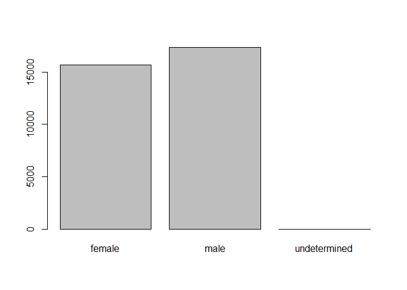

> ### Challenge
>
> -   Rename "F" and "M" to "female" and "male" respectively.
> -   Now that we have renamed the factor level to "undetermined", can
>     you recreate the barplot such that "undetermined" is last (after
>     "male")?

``` {.r}
levels(sex)[2:3] <- c("female", "male")
sex <- factor(sex, levels = c("female", "male", "undetermined"))
plot(sex)
```



[**Back to reading**](../../R-02-starting-with-data)
