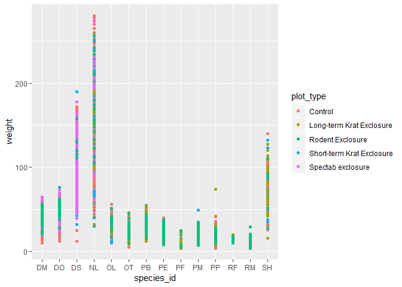

> ### Challenge
>
> Use what you just learned to create a scatter plot of `weight` over
> `species_id` with the plot types showing in different colors. Is this
> a good way to show this type of data?

``` {.r}
ggplot(data = surveys_complete, mapping = aes(x = species_id, y = weight)) +
    geom_point(aes(color = plot_type))
```



[Back to reading](../../R-04-visualization-ggplot2)
