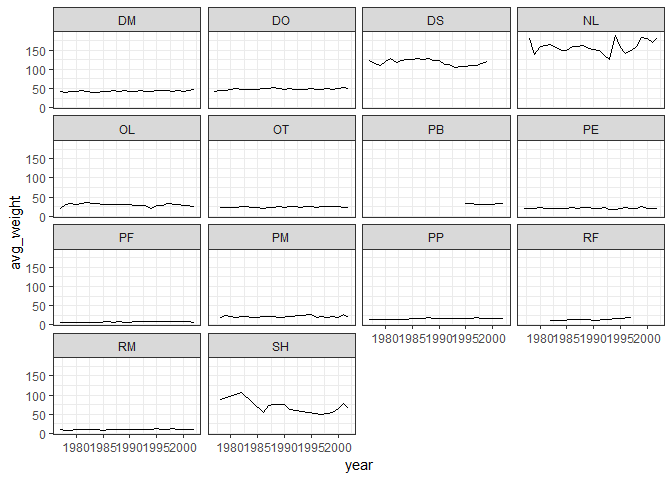

> ### Challenge
>
> Use what you just learned to create a plot that depicts how the
> average weight of each species changes through the years.

``` {.r}
yearly_weight <- surveys_complete %>%
    group_by(year, species_id) %>%
    summarize(avg_weight = mean(weight))

ggplot(data = yearly_weight, mapping = aes(x=year, y=avg_weight)) +
    geom_line() +
    facet_wrap(~ species_id) +
    theme_bw()
```



[Back to reading](../../R-04-visualization-ggplot2)
